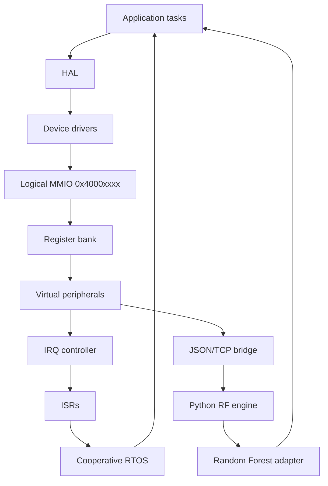

# System architecture

**Simulated time**: one MCU tick = `tick_ns` (default 1000 ns). Host wall-clock is used only for benchmarks. RTOS ticks every `rtos_div` MCU ticks (default 10 → 10 µs).

Memory map:

| Base | Peripheral |
| --- | --- |
| 0x40000000 | GPIO |
| 0x40000100 | UART |
| 0x40000200 | SPI |
| 0x40000300 | I2C |
| 0x40000400 | TIMER |
| 0x40000500 | IRQC |
| 0x40000600 | RADIO |
